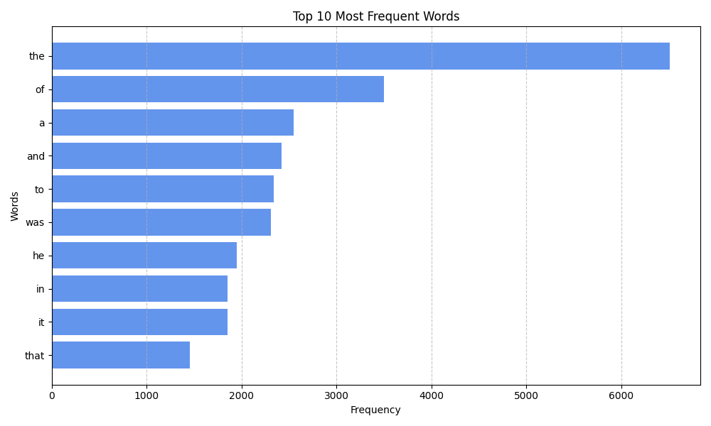

# goit-algo2-hw-06

## Напишіть Python-скрипт, який завантажує текст із заданої URL-адреси, аналізує частоту використання слів у тексті за допомогою парадигми MapReduce і візуалізує топ-слова з найвищою частотою використання у тексті.

```bash
python mapreduce_wordcount.py
```

## Результат

Загальна кількість слів для аналізу: 103526


